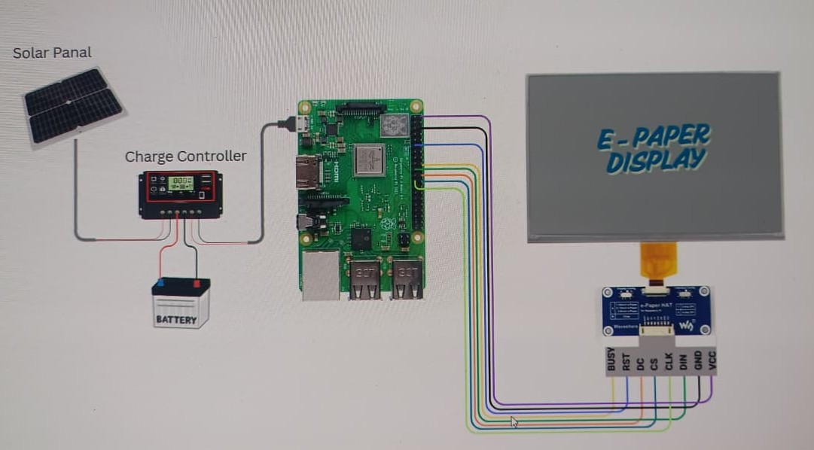

# Sustainable Solar-Powered E-Paper Digital Advertising System

This project presents an eco-friendly digital advertising solution that replaces conventional high-power LED/LCD billboards with **solar-powered E-Paper displays**. Designed for smart city environments, it operates **fully off-grid**, offers **high sunlight visibility**, and consumes **ultra-low power** — making it a long-term sustainable alternative to traditional digital signage.

---

## Problem Statement

Digital advertising has become essential in communication and marketing but typically depends on **LED/LCD displays**, which:

- Consume high power continuously
- Require frequent maintenance
- Contribute to light pollution and energy waste
- Are not sustainable for long-term environmental goals

There is a demand for a **greener, cost-efficient, and sustainable advertising alternative**.

---

## Proposed Solution

We introduce a **Solar-Powered E-Paper Display System** where:

- **Solar Panels** generate energy  
- **MPPT controller** ensures efficient power usage  
- **Battery backup** ensures 24×7 operation  
- **E-Paper Display** shows advertisements with **near-zero power consumption** (only uses power during content updates)
- **Raspberry Pi 3B+** enables remote content control and IoT connectivity

This drastically reduces energy consumption, eliminates grid dependency, and supports sustainable smart city development.

---

## System Architecture (Overview)

---

## Technology Stack

| Component | Purpose |
|----------|---------|
| **E-Paper Display** | Low-power visual output with excellent outdoor readability |
| **Raspberry Pi 3B+** | Controls display and manages content updates |
| **Battery Storage** | Enables uninterrupted operation |
| **Solar Panel** | Provides renewable energy |
| **MPPT Controller** | Maximizes solar power efficiency |
| **Driver / Interface HAT** | Controls E-Paper signal communication |

---

## Key Features

- **100% Solar Powered** — Completely off-grid
- **Ultra-Low Power Consumption**
- **High Readability in Sunlight**
- **Eco-Friendly and Sustainable**
- **Remote Content Updates via Raspberry Pi**
- **Weather-Resistant and Minimal Maintenance**
- **Scalable for Smart Cities / Rural Displays**

---

## Innovation & Uniqueness

Unlike LED/LCD displays, **E-Paper consumes power only when the screen content changes**, making it ideal for continuous outdoor advertisements. Paired with **solar energy and MPPT**, this system:

- Eliminates grid electricity usage
- Reduces operational & maintenance cost
- Supports government smart city & green initiatives

This solution modernizes advertising while **protecting the environment**.

---

## Impact & Scalability

| Impact Area | Benefit |
|-------------|---------|
| **Energy Efficiency** | Near-zero power consumption |
| **Environmental Sustainability** | Reduced carbon footprint |
| **Cost-Effective** | No electricity bills + low maintenance |
| **Rural & Remote Usability** | Works without power grid access |
| **Smart City Integration** | IoT-based monitoring & control |

Can be deployed in:
- Bus stands
- Railway stations
- Educational campuses
- Rural digital notice boards
- Smart city street information panels

---

